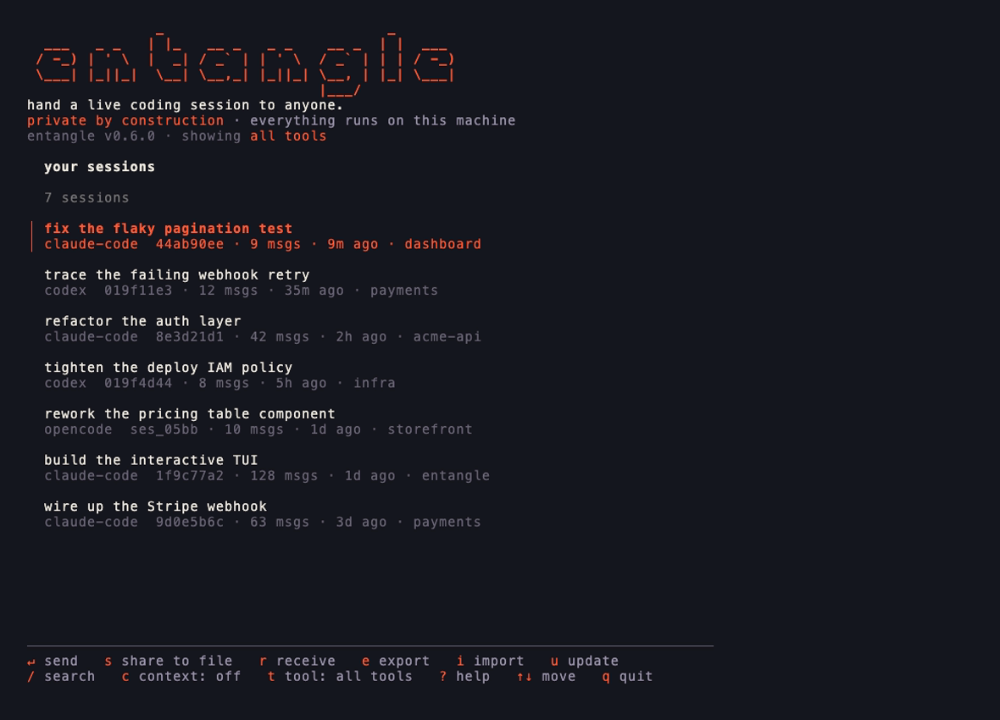
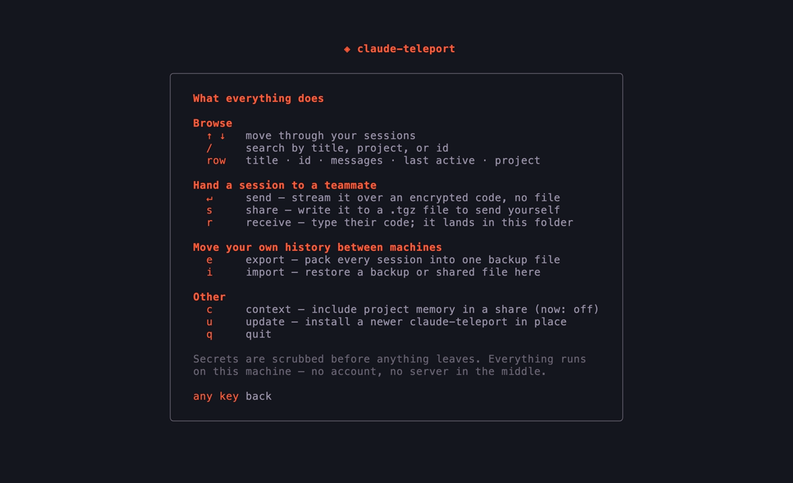
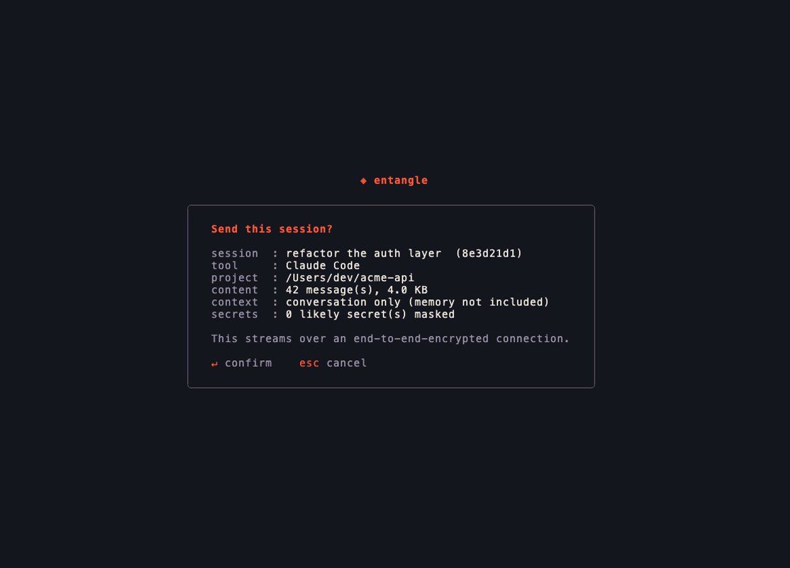

<div align="center">

# entangle

**Hand a live coding session to anyone.**

Claude Code, OpenAI Codex, and opencode. Encrypted, no account, three spoken words.

[](https://github.com/gowtham-sai-yadav/entangle/actions/workflows/ci.yml)
[](https://github.com/gowtham-sai-yadav/entangle/releases)
[](https://goreportcard.com/report/github.com/gowtham-sai-yadav/entangle)
[](LICENSE)


</div>

---

> Teleporting a quantum state takes two things: a pair of entangled particles, and
> one short message sent the ordinary way. Neither is enough on its own.
>
> This is the same trick, for your work. Two machines, and three words said out loud.

Your coding sessions live only on the machine that made them. So the day you want to
hand a conversation to a teammate, or move to a new laptop, you are stuck: copying the
folder by hand does not work, because every session is pinned to the exact path your
project sat at, and that path is different everywhere else.

entangle makes it one command. Send a live session straight to someone with a short
code they type in, or pack your whole history and carry it to a new machine, with every
path rewritten so the conversation opens where it left off.

It works across coding agents, not just one. A Claude Code session goes to Claude Code,
a Codex session to Codex, an opencode session to opencode - listed together, shared the
same way. (Opening one tool's session *inside another* is a different problem, and not
one this solves yet.)

It is private by construction. Nothing is uploaded, there is no account and no server in
the middle; a direct transfer is end-to-end encrypted, likely secrets are scrubbed before
anything leaves your machine, and your login never travels at all.

> **Renamed.** This project was `claude-teleport` until it outgrew a single vendor.
> The old command still works and still updates itself; it will tell you how to switch.

## Install

macOS and Linux:

```bash
curl -fsSL https://gowthamsai.in/install.sh | sh
```

With Homebrew:

```bash
brew install gowtham-sai-yadav/tap/entangle
```

Windows (PowerShell):

```powershell
irm https://gowthamsai.in/install.ps1 | iex
```

Each one fetches the right prebuilt binary, verifies its checksum, and puts it on your PATH. Confirm with `entangle version`.

<details>
<summary>Other ways: Go, direct download, from source</summary>

**With Go:**

```bash
go install github.com/gowtham-sai-yadav/entangle@latest
```

This installs into `$(go env GOPATH)/bin` (usually `~/go/bin`). If the command is not found afterward, that folder is not on your PATH yet: `echo 'export PATH="$HOME/go/bin:$PATH"' >> ~/.zshrc && source ~/.zshrc`.

**Direct download:** grab the file for your machine from the [latest release](https://github.com/gowtham-sai-yadav/entangle/releases/latest) (`...-darwin-arm64` for Apple Silicon, `-darwin-amd64` for Intel Macs, `-linux-amd64`, or `-windows-amd64.exe`), then on macOS/Linux `chmod +x` it and move it onto your PATH.

**From source:**

```bash
git clone https://github.com/gowtham-sai-yadav/entangle
cd entangle && go build -o entangle .
```

</details>

## Start here: the interactive cockpit

The quickest way in is to just run:

```bash
entangle
```

<p align="center">
  
</p>

With a terminal attached, that opens a full-screen cockpit: your sessions in a searchable list, with every action a keypress away. Send one to a teammate over an encrypted code, share it to a file, receive one, export or import a backup, or update in place, all without remembering a single flag. Press `?` for what each key does. Run `entangle tui` to open it explicitly; piped or scripted, the same binary behaves like a normal CLI.

<p align="center">
  
</p>

Prefer typing the commands yourself? Everything below works on its own too.

## Share a session with a teammate

Hand one conversation to someone else, with all its context intact, so they can carry it forward. Find the session first:

```bash
entangle sessions
```

Then send it one of two ways.

**Straight across, by code** (no file to move, nothing uploaded anywhere):

```bash
entangle send <id>
```

You read out the short code it prints; they run `entangle receive <code>` from their copy of the project. The transfer is end-to-end encrypted, so no server can read it.

<p align="center">
  
</p>

**As a file**, if they are not around right now:

```bash
entangle share <id>
```

They import it later with `entangle import <file>`.

Either way, likely secrets (keys, tokens, passwords) are scrubbed before anything leaves your machine, and your login is never included. `--last` picks your most recent session, and `--with-context` also includes the project's memory files.

## Move to a new machine

Moving all of your work to a new computer is two commands, one on each.

**On the old machine**, pack everything into a file:

```bash
entangle export
```

Copy the file it creates to the new machine any way you like: AirDrop, a USB stick, `scp`.

**On the new machine**, install Claude Code and sign in once, then restore:

```bash
entangle import entangle-backup-*.tgz
```

It shows you every project and where it will land, asks you to confirm, fixes the paths, and checks your sessions are resume-ready. Add `--dry-run` to preview without writing anything, and `--map /old/path=/new/path` if it guesses a location wrong.

Then open a project and carry on:

```bash
cd ~/path/to/your/project
claude --resume
```

> Your login does not transfer, on purpose. Credentials are locked to each machine, so just sign in once on the new one.

## Prefer clicking?

```bash
entangle gui
```

opens a small wizard in your browser to pick a bundle and import it. Everything stays on your machine.

## In your editor

Prefer to stay in VS Code? The [entangle extension](vscode/) adds the same actions to the Command Palette, a status-bar button, and a sidebar: send a session by code, receive one, share to a file, or browse your sessions. It drives the CLI under the hood and offers to install it for you on first use, so the extension is all you need.

## Updating

```bash
entangle update
```

checks for a newer release and swaps the binary in place. (`brew upgrade entangle` works too, or re-run whichever installer you used.)

## What moves, and what doesn't

**Moves:** your sessions, project memory, settings, prompt history, and the portable parts of `~/.claude.json`, all re-pathed for the new machine.

**Never moves:** your login. Credentials are machine-locked and deliberately left out.

**Skipped:** caches, telemetry, and other throwaway files that rebuild themselves.

## Different operating systems

Import runs on the destination, so it detects the OS and translates everything, including Windows drive letters and backslashes. Linux and macOS paths look like `/home/you` or `/Users/you`; Windows uses `C:\Users\you`. You do not have to do anything special, it just works in any direction.

<details>
<summary>Is it safe, and how does it work?</summary>

**Safe by default:**

- It never overwrites an existing file. It merges and tells you what it skipped; `--overwrite` backs up each replaced file first.
- `--dry-run` shows exactly what will happen before anything is written.
- The file-based flow is fully offline. Sharing scrubs likely secrets (best effort, so glance at what you send) and never includes your login.

**How it works:**

A bundle is a `.tgz` with a manifest that records each project's true absolute path, the piece the folder name throws away, read from `~/.claude.json` and the `cwd` stored inside each transcript. On import it re-encodes the folder names for the target OS, rewrites the in-file paths (matching Windows paths in their JSON-escaped form so none are missed), merges without overwriting, and verifies every session is resume-ready.

The full design and reasoning is in [DESIGN.md](DESIGN.md).

</details>

<details>
<summary>All commands and flags</summary>

```
entangle                    open the interactive cockpit (default when a terminal is attached)
entangle tui                open the interactive cockpit explicitly
entangle export   [--out FILE] [--config-dir DIR]
entangle import   <bundle> [flags]
entangle inspect  <bundle>
entangle verify   [--config-dir DIR]
entangle sessions [--tool T] [--project P] [--config-dir DIR] [--json]
entangle share    <session-id | --last> [--tool T] [--project P] [--out FILE] [--with-context] [--no-redact] [--yes]
entangle send     <session-id | --last> [--tool T] [--project P] [--with-context] [--no-redact] [--rendezvous URL] [--relay HOST:PORT] [--yes]
entangle receive  <code> [--config-dir DIR] [--map OLD=NEW]... [--rendezvous URL] [--relay HOST:PORT] [--yes]
entangle update   [--check] [--yes]
entangle gui      [bundle] [--port N]
```

`import` flags:

| Flag | What it does |
|---|---|
| `--dry-run` | Show the plan and write nothing. A good first run. |
| `--map OLD=NEW` | Remap a path prefix (repeatable). The most specific match wins. |
| `--project P` | Import only this project, by path or folder (repeatable). |
| `--target-home DIR` | Override the detected home directory. |
| `--target-os OS` | Render paths for `linux`, `darwin`, or `windows`. |
| `--overwrite` | Replace existing files (each is backed up first). |
| `--deep` | Rewrite old paths everywhere in transcripts, not just the `cwd` field. |
| `--yes` | Skip the confirmation prompt. |

`--tool` takes `claude-code`, `codex`, `opencode`, or `all`. It defaults to `all`, so you rarely need it: `sessions` shows every agent on the machine, and `share`/`send` work out which one an id belongs to. Pass it when you want a listing narrowed to a single tool.

`inspect` shows what is inside a bundle. `verify` checks the sessions already on this machine are resume-ready (Claude Code only, like `export`). `send`/`receive` use the public magic-wormhole servers by default; point them at your own with `--rendezvous`/`--relay` or the `ENTANGLE_RENDEZVOUS`/`ENTANGLE_RELAY` environment variables.

</details>

<details>
<summary>FAQ</summary>

**Will this delete anything on my old machine?** No. `export` only reads.

**Do I need Claude Code on the new machine first?** Yes. Install it and sign in once so your account is set up, then import.

**My new username or OS is different.** That is handled. Preview with `--dry-run` and adjust with `--map` if a guess is off.

**I only want a few projects.** Use `--project <path-or-folder>` (repeatable), or tick just those in the GUI.

**Where does Claude Code keep all this?** Under `~/.claude/` and `~/.claude.json` (`%USERPROFILE%` on Windows). Set `CLAUDE_CONFIG_DIR` to relocate it; entangle respects that variable.

**Some sessions are missing from the list.** Sessions recorded inside a temporary directory are hidden, since they are throwaway (some tools run Claude Code from a scratch folder and leave hundreds behind). Set `ENTANGLE_INCLUDE_TEMP=1` to show them.

**Do other coding agents work?** Yes, and you do not have to say so. [OpenAI Codex CLI](https://github.com/openai/codex) and [opencode](https://github.com/anomalyco/opencode) sessions are listed alongside your Claude Code ones by default, and share and send the same way:

```bash
entangle sessions                   # every tool on this machine
entangle send <id>                  # the tool is worked out from the id
entangle sessions --tool codex      # narrow it when you want only one
```

In the cockpit (`entangle` on its own) the list starts with every tool merged together; press `t` to step through one tool at a time and back to all.

The receiving side needs no flag either: which tool a session came from travels with it, so `receive` and `import` put it back where it belongs. They do need that tool installed. Two things are not covered yet - opening a session from one tool inside a different one (a Codex session goes to Codex), and whole-machine `export`/`verify`, which read the Claude Code layout only. Move a Codex or opencode session with `share`/`send` instead; both say so when they leave something out.

</details>

## Contributing

Issues and pull requests are welcome. The architecture and design decisions are written up in [DESIGN.md](DESIGN.md). To develop:

```bash
go test ./...                                    # unit tests
go test -tags integration ./internal/transfer/   # a real send/receive over a local server
go vet ./... && gofmt -l .                        # checks (gofmt should print nothing)
```

CI runs on Linux, macOS, and Windows. Tagging `vX.Y.Z` builds and publishes the release automatically.

## License

[MIT](LICENSE) © Gowtham Sai Yadav

---

<sub>An independent, unofficial community project. Not affiliated with, endorsed by, or sponsored by Anthropic. "Claude" and "Claude Code" are trademarks of Anthropic, PBC, used here only to describe what this tool works with.</sub>
